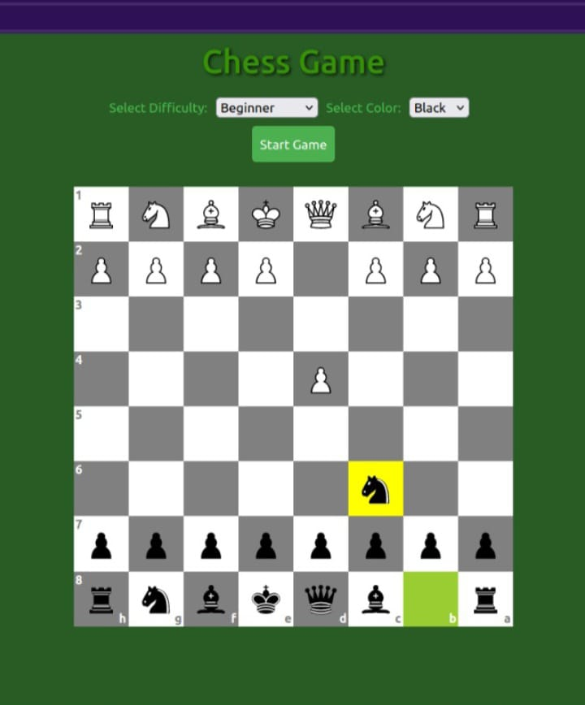
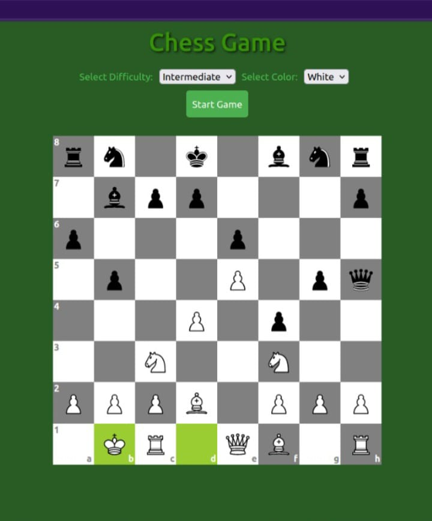
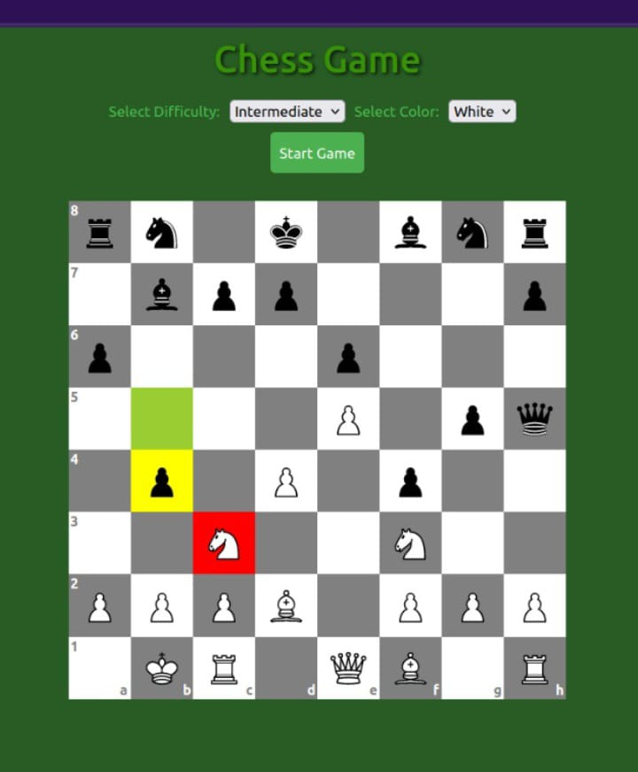
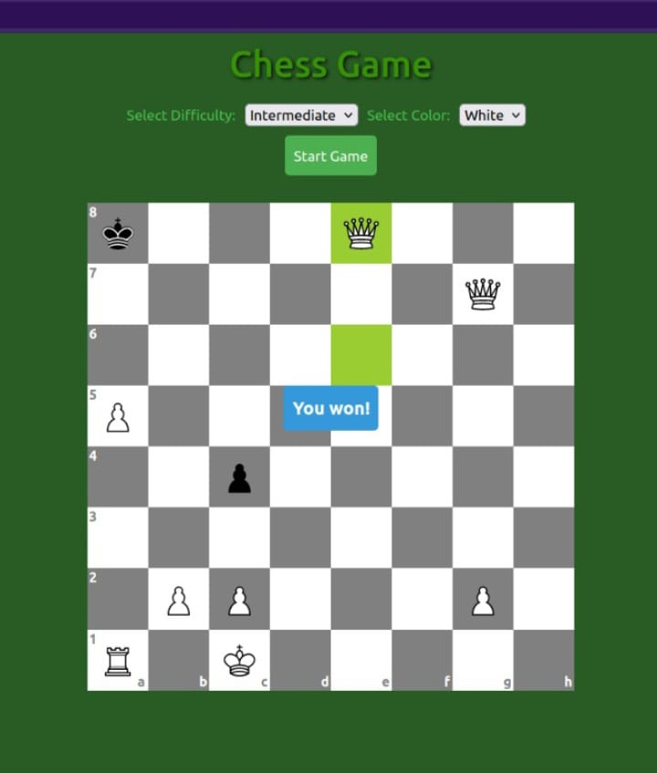

# Chess Game Project

## Overview

Welcome to the Chess Game project! This project implements a chess game where users can play against the computer. The project is divided into a frontend and a backend, with the backend utilizing Celery for task queue management.

## Backend

The backend of the Chess Game is powered by Django, Django Rest Framework, and Celery for handling asynchronous tasks. Celery is employed for analyzing the computer's movements during gameplay, ensuring a responsive and engaging gaming experience.

### Getting Started
1. Install Python 3 and pip: Python
2. Create and activate a virtual environment:
    * python -m venv env
    * source ./env/bin/activate

### Install Django and dependencies:
* pip install django djangorestframework django-cors-headers

### RabbitMQ and Celery
1. Download rabbitMQ. For Ubuntu, you can follow these instructions: https://www.rabbitmq.com/install-debian.html#apt-quick-start-cloudsmith
2. Install celery rabbitMQ:
    * pip install celery[rabbitmq]
3. Optionally, install Flower for monitoring Celery tasks:
    * pip install flower

### Running the Backend

Open three terminals to run the backend components:
* django-admin startproject chess_proj
* cd chess_proj
* python manage.py makemigrations
* python manage.py migrate
* python manage.py createsuperuser
* python manage.py runserver

### Running the Celery worker:

* celery -A chess_proj worker --loglevel=info

### (Optional) Flower monitoring tool:

* flower -A chess_proj

## Frontend

The frontend of the Chess Game is built using React, which orchestrates the game flow and interacts with the backend API. Users can select the difficulty level and their preferred color (white or black) before starting the game. The game status, such as checkmate, victory, defeat, or draw, is displayed to the user ending the game. 
**Note for Advanced Level:**
In the advanced difficulty level, be prepared for a more challenging game! The computer will analyze its moves thoroughly, and it might take around one minute for the computer to make a move as it carefully considers its strategy.

### Getting Started
1. Install Node.js and npm: Node.js
2. Clone the repository: git clone https://github.com/Lauferin/chess.git
3. Navigate to the frontend folder: cd chess_proj/chess-fe
4. Install dependencies: npm install

### Running the Frontend
To run the frontend, execute the following command in the frontend terminal:
* npm run start

## Usage

    After setting up the frontend and backend, navigate to the frontend terminal and run the frontend server.
    Open a browser and go to http://localhost:3000/ to access the Chess Game.
    Select the difficulty level and preferred color, then click "Start Game" to begin playing against the computer.

Enjoy playing chess!

 &nbsp;
 &nbsp;
 &nbsp;
 

Feel free to reach out if you have any questions or encounter issues. Happy gaming!